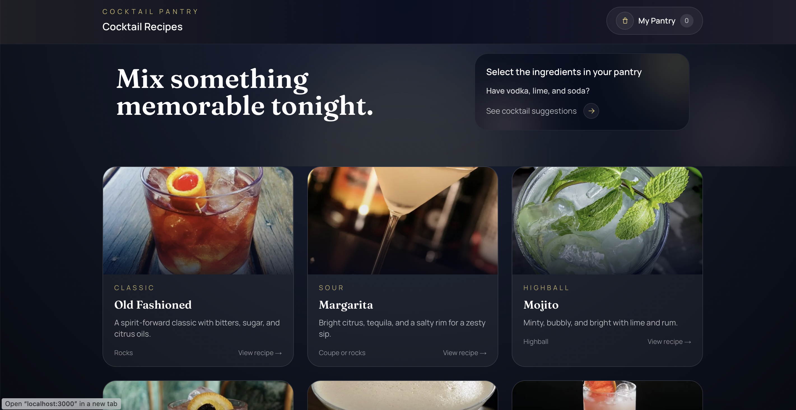
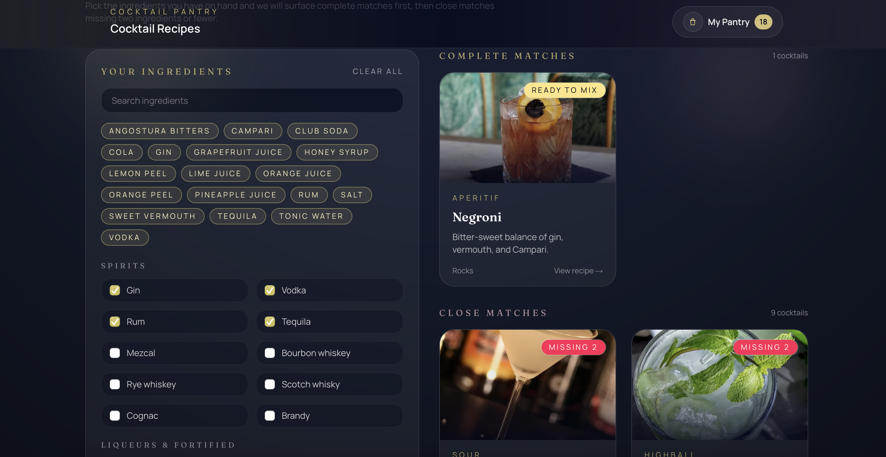
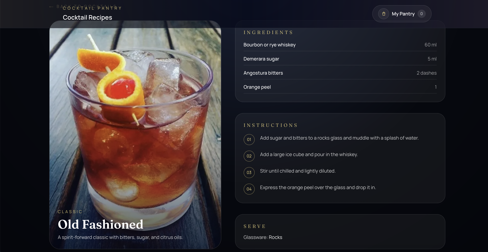

## App Screenshots





# Cocktail Pantry

A simple, visual way to see which cocktails you can make from the ingredients you already have.

## Motivation

I built Cocktail Pantry to learn how to vibe code and quickly turn product ideas into testable proof-of-concepts as an aspiring product manager. I also love making cocktails, so I wanted an app that tells me what I can mix from the ingredients already in my cupboard.


## What you can do

- Browse featured cocktails on the home page.
- Select the ingredients in your pantry to get exact matches first.
- See close matches that are missing two ingredients or fewer.
- Open a recipe page with ingredients and steps.
- Your pantry selection is saved locally in your browser so it stays between visits.

## How to run locally (step-by-step)

1. Install Node.js (version 18 or newer is safest).
2. In this project folder, install dependencies:

```bash
npm install
```

3. Start the local app:

```bash
npm run dev
```

4. Open the URL shown in the terminal (usually `http://localhost:3000`).

## Where the app data lives

- Cocktail data: `src/data/cocktails.ts`
- Ingredient list: `src/data/ingredients.ts`
- Matching logic: `src/utils/cocktailMatcher.ts`

## Project layout (high level)

- App pages: `src/app/`
- UI components: `src/components/`
- Static assets (screenshots): `assets/`

## Tech stack

- Next.js + React + TypeScript
- Tailwind CSS
